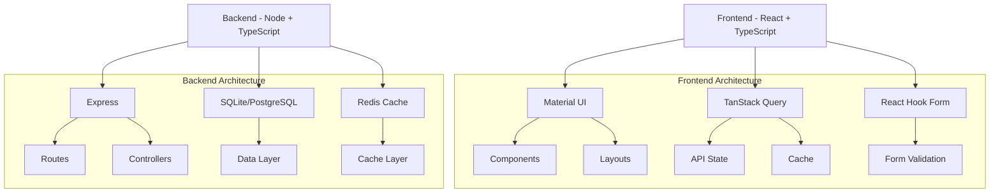

# URL Shortener - Architectural Decisions & Rationale

## Project Architecture Overview



## Technology Choices & Rationale

### Frontend Stack Decisions

1. **Why TanStack Query?**
   - Problem: Managing server state, caching, and synchronization
   - Traditional Solutions:
     - Redux: Too verbose for simple data fetching
     - Custom hooks: No built-in caching
     - Fetch in components: No centralized state
   - Why TanStack Query is Better:
     - Automatic background updates
     - Built-in caching with configurable invalidation
     - Optimistic updates for better UX
     - Automatic error handling and retries
     - Reduced network requests
     - TypeScript support out of the box

2. **Why React Hook Form?**
   - Problem: Form handling and validation
   - Alternative Solutions:
     - Formik: Larger bundle size, more complex API
     - Custom state: No performance optimizations
     - Controlled components: Unnecessary re-renders
   - Benefits:
     - Minimal re-renders
     - Built-in validation
     - Better performance
     - Smaller bundle size
     - TypeScript support

3. **Why Material UI?**
   - Problem: Building a professional, consistent UI
   - Alternatives Considered:
     - Tailwind: More setup, less consistent components
     - Chakra UI: Less mature, smaller community
     - Custom CSS: Time-consuming, inconsistent
   - Benefits:
     - Production-ready components
     - Consistent design language
     - Accessibility out of the box
     - Extensive documentation
     - Large community support

### Component Structure Rationale

```
frontend/
├── features/           # Why? Domain-driven design
│   └── url-shortener/ # Why? Feature isolation
├── components/        # Why? Reusable UI elements
├── layouts/           # Why? Consistent page structure
├── services/          # Why? API abstraction
└── utils/             # Why? Shared functionality
```

#### Component Organization Philosophy
1. **Feature-First Approach**
   - Why? Scales better with application growth
   - Why? Makes code ownership clear
   - Why? Easier to maintain and test
   - Why? Better code discovery

2. **Shared Components**
   - Why? DRY principle
   - Why? Consistent UI/UX
   - Why? Single source of truth
   - Why? Easier updates

### Backend Architecture Decisions

1. **Why Node.js with TypeScript?**
   - Problem: Need high throughput with type safety
   - Alternatives:
     - Go: Steeper learning curve
     - Python: GIL limitations
     - Java: More verbose, slower development
   - Benefits:
     - Non-blocking I/O
     - Large ecosystem
     - TypeScript safety
     - Easy team onboarding

2. **Why SQLite (PostgreSQL-ready)?**
   - Problem: Need reliable data storage with easy migration path
   - Alternatives:
     - MongoDB: No ACID out of box
     - MySQL: More setup overhead
   - Benefits:
     - Zero configuration
     - ACID compliant
     - Easy PostgreSQL migration
     - File-based (great for development)

3. **Why In-Memory Cache with Redis-Ready Architecture?**
   - Problem: Need fast responses with scalability
   - Solution: Two-tier caching
     - Development: node-cache
     - Production: Redis
   - Benefits:
     - Fast development cycle
     - Easy production scaling
     - No additional services in development

## Key Implementation Decisions

### 1. URL Generation Strategy
- Why Base62?
  - More characters than Base36
  - URL-safe unlike Base64
  - Human-readable unlike UUID
  - 6-8 chars sufficient for billions

### 2. Caching Strategy
- Why Two-Tier?
  - In-memory: Fastest response
  - Redis: Scalable across nodes
  - CDN: Global distribution

### 3. Security Approach
- Why Multiple Layers?
  ```
  Frontend ─> API Gateway ─> Application ─> Database
  │            │             │              │
  └─ Input     └─ Rate      └─ Input       └─ Prepared
     Validation   Limiting      Sanitization   Statements
  ```
  - Defense in depth
  - Different attack vectors
  - Fail-safe defaults

## Code Review Notes

### Frontend Code Notes

```typescript
// src/features/url-shortener/hooks/useUrlShortener.ts

/*
 * Why Custom Hook?
 * - Separates business logic from UI
 * - Reusable across components
 * - Easier testing
 * - Centralized error handling
 */

/*
 * Why TanStack Query Here?
 * - Automatic cache invalidation
 * - Optimistic updates
 * - Loading/error states
 * - Retry logic
 */

/*
 * Why This Error Handling?
 * - User-friendly messages
 * - Detailed logging
 * - Recovery options
 */
```

### Backend Code Notes

```typescript
// src/modules/url/url.service.ts

/*
 * Why Service Layer?
 * - Business logic isolation
 * - Easier testing
 * - Single responsibility
 * - Dependency injection
 */

/*
 * Why This Caching Strategy?
 * - Reduces database load
 * - Fast responses
 * - Memory efficient
 * - Cache invalidation control
 */

/*
 * Why These Security Measures?
 * - Prevent injection
 * - Rate limiting
 * - Input validation
 * - Audit logging
 */
```

## Performance Considerations

### Why These Specific Optimizations?

1. **Frontend**
   - Code splitting: Reduces initial bundle size
   - Memoization: Prevents unnecessary re-renders
   - Preloading: Improves perceived performance
   - Service worker: Offline support

2. **Backend**
   - Connection pooling: Reuses connections
   - Prepared statements: Query optimization
   - Batch operations: Reduces database load
   - Compression: Reduces network traffic

## Scalability Decisions

### Why This Scaling Strategy?

1. **Horizontal Scaling**
   - Stateless design
   - Cache sharing
   - Load balancing
   - Database sharding

2. **Vertical Scaling**
   - Connection pooling
   - Query optimization
   - Memory management
   - CPU optimization

## Development Philosophy

### Why These Practices?

1. **Code Organization**
   - Feature-based: Natural boundaries
   - Shared utilities: DRY principle
   - Type safety: Catch errors early
   - Documentation: Knowledge sharing

2. **Testing Strategy**
   - Unit tests: Function correctness
   - Integration tests: Feature correctness
   - E2E tests: User flow correctness
   - Performance tests: System health

## Conclusion

This architecture is designed for:
- Rapid development
- Easy maintenance
- Scalable growth
- Secure operations
- High performance
- Team collaboration

Each decision is made with consideration for:
- Current requirements
- Future scalability
- Team efficiency
- Code maintainability
- System security
- User experience