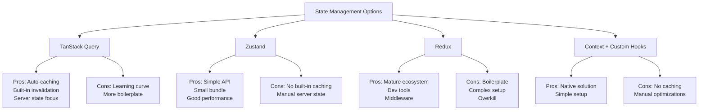
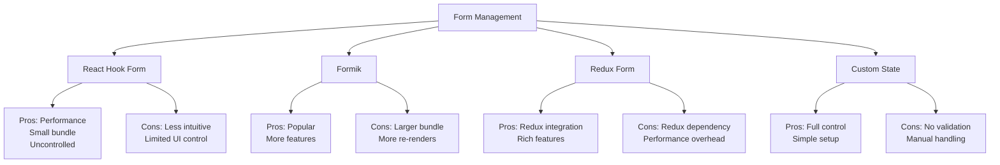
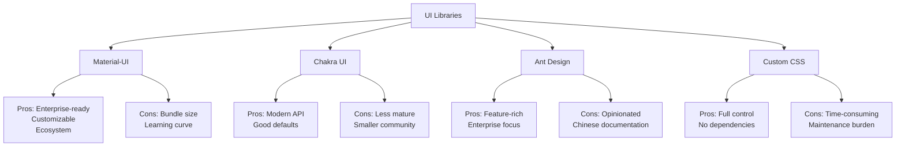
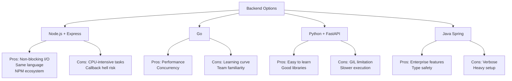

# URL Shortener - Technology Decisions & Trade-offs

## Technology Stack Analysis

### State Management: Why TanStack Query vs Alternatives?



#### Why Not Zustand?
1. **Server State Handling**
   - Zustand: Manual caching, invalidation, and error handling
   - TanStack Query: Built-in solutions for server state
   ```typescript
   // Zustand approach - manual handling
   const useStore = create((set) => ({
     data: null,
     loading: false,
     error: null,
     fetch: async () => {
       set({ loading: true });
       try {
         const data = await api.get();
         set({ data, loading: false });
       } catch (error) {
         set({ error, loading: false });
       }
     }
   }));

   // TanStack Query - automatic handling
   const { data, isLoading, error } = useQuery({
     queryKey: ['key'],
     queryFn: () => api.get()
   });
   ```

2. **Cache Management**
   - Zustand: Need custom implementation
   - TanStack Query: Automatic with configurable options

3. **Use Case Fit**
   - Zustand: Better for UI state
   - TanStack Query: Optimized for API data

### Form Management: Why React Hook Form vs Alternatives?



#### Performance Comparison
```typescript
// React Hook Form - Efficient
const { register } = useForm();
<input {...register('field')} /> // Uncontrolled, no re-renders

// Formik - More re-renders
<Formik>
  <Field name="field" /> // Controlled, re-renders on each change
</Formik>

// Custom State - Manual optimization needed
const [value, setValue] = useState('');
<input value={value} onChange={e => setValue(e.target.value)} />
```

### UI Library: Why Material-UI vs Alternatives?



### Backend: Why Node.js + Express vs Alternatives?



## Code Implementation Decisions

### URL Generation Strategy

#### Why Base62 vs Alternatives?
```typescript
/**
 * Why Base62?
 * - More characters than Base36 (26+26+10 = 62 chars)
 * - URL-safe unlike Base64 (no special chars)
 * - Human-readable unlike UUID
 * - 6-8 chars sufficient for billions
 * 
 * Why Not Alternatives?
 * - UUID: Too long (36 chars)
 * - Base36: Less combinations
 * - Base64: URL encoding issues
 * - Sequential: Predictable, security risk
 */
```

### Caching Strategy

#### Why Multi-Level Caching?
```typescript
/**
 * Why This Approach?
 * - In-memory: Fastest (sub-millisecond)
 * - Redis: Scalable, persistent
 * - CDN: Global distribution
 * 
 * Why Not Alternatives?
 * - Single Redis: Higher latency
 * - Only CDN: Cache miss expensive
 * - Only in-memory: No persistence
 */
```

### Database Choice

#### Why SQLite → PostgreSQL Path?
```typescript
/**
 * Why This Path?
 * - SQLite: Zero config, ACID, file-based
 * - PostgreSQL: Production-ready, scalable
 * 
 * Why Not Alternatives?
 * - MongoDB: No ACID by default
 * - MySQL: More complex replication
 * - Direct PostgreSQL: Overkill for dev
 */
```

## Architecture Patterns

### Why Feature-First vs Alternative Patterns?

```typescript
// Feature-First Structure
src/
  features/
    url-shortener/
      components/
      hooks/
      utils/
  shared/
    components/
    hooks/

// vs Technical-First (Not Chosen)
src/
  components/
  hooks/
  utils/
  pages/

/**
 * Why Feature-First?
 * 1. Better scalability
 * 2. Clear boundaries
 * 3. Easier code splitting
 * 4. Team ownership
 * 
 * Why Not Technical-First?
 * 1. Feature code scattered
 * 2. Harder to maintain
 * 3. Poor code discovery
 * 4. Difficult to split
 */
```

## Security Implementation

### Why Defense in Depth vs Single Layer?

```typescript
/**
 * Why Multiple Layers?
 * 1. Frontend validation
 * - Quick user feedback
 * - Reduce server load
 * 
 * 2. API Gateway
 * - Rate limiting
 * - Basic filtering
 * 
 * 3. Application validation
 * - Business rules
 * - Deep validation
 * 
 * 4. Database constraints
 * - Data integrity
 * - Last defense
 * 
 * Why Not Single Layer?
 * - Single point of failure
 * - Bypass risks
 * - No defense depth
 */
```

## Performance Optimizations

### Why This Combination?

```typescript
/**
 * Why These Specific Choices?
 * 1. Code splitting
 * - Lazy loading
 * - Route-based splitting
 * - Component-based splitting
 * 
 * 2. Caching strategy
 * - Browser cache
 * - Application cache
 * - Database cache
 * 
 * Why Not Alternatives?
 * - Single bundle: Larger initial load
 * - No caching: Higher latency
 * - Over-optimization: Complexity
 */
```

## Testing Strategy

### Why This Approach?

```typescript
/**
 * Why This Testing Stack?
 * 1. Unit tests: Vitest
 * - Faster than Jest
 * - Better Vite integration
 * 
 * 2. Integration: React Testing Library
 * - User-centric testing
 * - Real DOM testing
 * 
 * 3. E2E: Cypress
 * - Visual testing
 * - Real browser
 * 
 * Why Not Alternatives?
 * - Jest: Slower, setup overhead
 * - Enzyme: Implementation details
 * - Selenium: More complex
 */
```

## Conclusion

Each technology choice was made based on:
1. Use case fit
2. Performance requirements
3. Team expertise
4. Future scalability
5. Maintenance burden

The stack is optimized for:
- Rapid development
- Easy maintenance
- Production readiness
- Team collaboration
- Future scalability

Remember: These choices are contextual. Different requirements might lead to different choices.